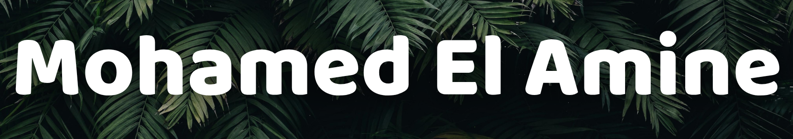

---

## ✏️ About Me

Hi! I’m **Mohamed El Amine** — a student of **Software Engineering** and **embedded system**  
Building **real‑time applications**, exploring **scalable architectures**, and tinkering with **ARM/RISC-V** projects.

* 🚀 **Currently building**
  * **Morse** — secure, real‑time messaging with **E2EE**
    
* 💡 **Interests**: full‑stack engineering, system design, DevOps, and embedded hardware

## 🏗️ Build Focus

**Real-time systems**: WebSockets, event-driven patterns, backpressure, load balancing, horizontal scaling
**Programming**:
* **Java** – object-oriented design, collections, concurrency, backend services
* **Python** – scripting, data processing, automation, quick prototyping
* **Embedded/SoC** - ARM Cortex series, Rockchip RK3588, Allwinner SoCs, RISC-V platforms — focus on boot optimization, power efficiency, Linux bring-up, and peripheral integration

---

## ✅ Tech Stack

  
  
  
  
  
  
  

**Also using**: React • Node.js • Socket.IO • Prisma • Docker • Nginx • Redis • TailwindCSS • GitHub Actions • Linux (Arch/Fedora)